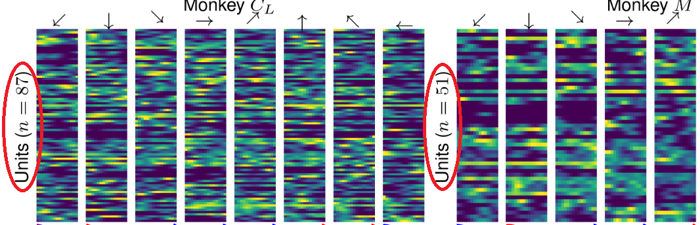

# Mini project #1

Hi!

We've already reviewd the repo together. So you should be familiar with the code structure.
Please, perform the following tasks (ideally, each person does 1 task):

First, someone should _fork_ the repo and make a branch called `Q1-dev`. Add all the team members to your forked repo as collaborators. Everyone clone the forked repo, checkout to `Q1-dev` and perform one of the following tasks:

1. Review the the code in [`fig2.ipynb`](/paper/fig2.ipynb) and ensure it is compliant to PEP8 guidelines.
1. In `paper/fig2.ipynb`, certain variables are added to the namespace from the `_dataset-selection.ipynb` notebook via the `%run` magic command. This is prone to errors as the exact variables being imported are not explicit. Resolve this issue following best practices.
1. The raster panel in `fig2` makes use of 2 functions defined in [`rasterTools.py`](/tools/rasterTools.py). To the best of your knowledge, refactor those functions. For instance, add docstring, descriptive comments, and type annotation, improve the function arguments (e.g., the `gs` object has a `.fig` attribute, so having a `fig` argument in the function signature is a bad practice), etc.
1. In the raster plot in `fig2`, one example animal has more units than the other (see the image below). Generate and save another figure where the raster plot sub-samples the units such that both animals have the same number of units. Plot the subsampled raster plot 5 time to ensure that the two animals are comparable regardless of the selected units.

1. In the raster plot in `fig2`, the scale of the hand trajectories (bottom panel called 'Position', see the image above) is not clear. Add a shcematic $x-y$ coordinate and indicate the scale of both axes.

In the end, everyone should commit their development to the `Q1-dev` branch, ensuring their work can be merged. Then, submit a Pull Request (PR) to merge your changes to the `main` branch of the original repo ([https://github.com/AtMostafa/good-coding-practices/](https://github.com/AtMostafa/good-coding-practices/)). We might review your PR together in the wokshop.

Best of luck and don't hesitate to ask if you have any questions.
