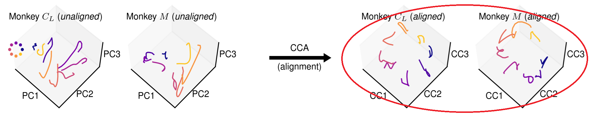
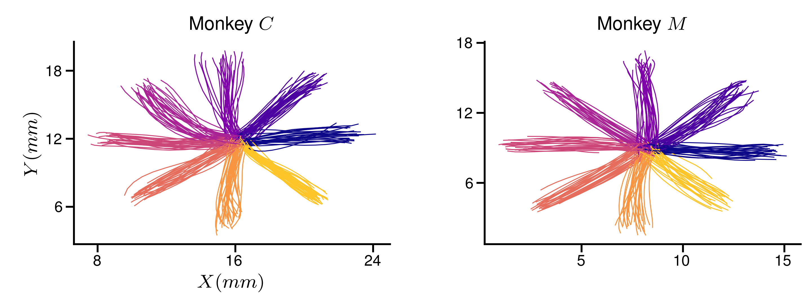

# Mini project #2

Hi!

We've already reviewd the repo together. So you should be familiar with the code structure.
Please, perform the following tasks (ideally, each person does 1 task):

First, someone should _fork_ the repo and make a branch called `Q2-dev`. Add all the team members to your forked repo. Everyone clone the forked repo, checkout to `Q2-dev` and perform one of the following tasks:

1. Review the the code in [`fig2.ipynb`](/paper/fig2.ipynb) and ensure it is compliant to PEP8 guidelines.
1. In `paper/fig2.ipynb`, certain variables are added to the namespace from the `_dataset-selection.ipynb` notebook via the `%run` magic command. This is prone to errors as the exact variables being imported are not explicit. Resolve this issue following best practices.
1. The 3D dynamics panel in `fig2` uses `plot_monkey_pc_example` to plot the 3D plots. Similar to the raster panel in the same notebook, move this function to a python script (add a new file if needed, use your best judgement), refactor the code and then import the function in the top cell of the `fig2` notebook. Then use it to plot the 3D dynamics.
1. The right side of the 3D dynamics figure, shows the neural activity 'aligned' using a technique called the Canonical Correlation Analysis, or CCA (see the image below). You'll find that CCA has been calculated using a custom function ported from its MATLAB implementation. However, the popular python package, `scikit-learn` also has an implementation of CCA. Replace the custom code with the `scikit-learn` function, __without__ changing any code in `fig2`.

1. Plot the average hand trajectoy to each target for the 2 sessions of data available. It should look like the figure below, but plot only the 1 trace to each target taht represents the average behaviour.

In the end, everyone should commit their development to the `Q2-dev` branch, ensuring their work can be merged. Then, submit a Pull Request (PR) to merge your changes to the `main` branch of the original repo ([https://github.com/AtMostafa/good-coding-practices/](https://github.com/AtMostafa/good-coding-practices/)). We might review your PR together in the wokshop.

Best of luck and don't hesitate to ask if you have any questions.
