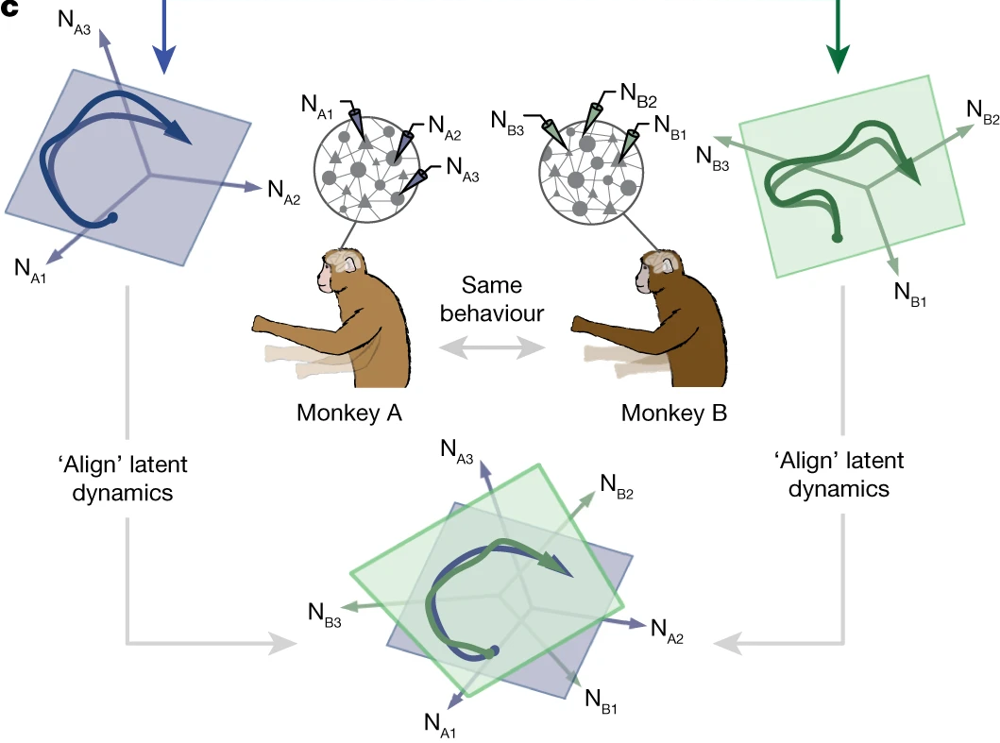

# Mini project #3

Hi!

We've already reviewd the repo together. So you should be familiar with the code structure.
Please, perform the following tasks (ideally, each person does 1 task):

First, someone should _fork_ the repo and make a branch called `Q3-dev`. Add all the team members to your forked repo as collaborators. Everyone clone the forked repo, checkout to `Q3-dev` and perform one of the following tasks:

1. Review the the code in [`fig2.ipynb`](/paper/fig2.ipynb) and ensure it is compliant to PEP8 guidelines.
1. In `paper/fig2.ipynb`, certain variables are added to the namespace from the `_dataset-selection.ipynb` notebook via the `%run` magic command. This is prone to errors as the exact variables being imported are not explicit. Resolve this issue following best practices.
1. Navigate to the bottom of the `fig2` notebook. You'll find that the majority of the code that analyses the data is located in [ccaTools.py](/tools/ccaTools.py). Refactor the code in that file, improve readability and compliance to PEP8.  
If certain functions are never used _anywhere_ in the repo, they can safely be deleted. To do so, use your best judgement to dedicate either a commit, or a branch or a tag to delete all the unused code.
1. Navigate to the bottom of the `fig2` notebook. The figure shows the neural activity from 2 animals 'aligned' using a technique called the Canonical Correlation Analysis, or CCA (see the image below for a graphical description). You'll find that CCA has been calculated using a custom function ported from its MATLAB implementation. However, the popular python package, `scikit-learn` also has an implementation of CCA. Replace the code _within_ the function [`canoncorr()`](/tools/ccaTools.py#L315) with the `scikit-learn` function, without changing any other code.  

    

1. Perhaps the most critical function in this repo is [`get_data_array()`](/tools/dataTools.py#L81). This function accepts a list of `pd.DataFrame`s, applies a dimensionality reduction methods, like PCA to them, restrict the trials to a specific epoch, and returns a tensor  of the form $sessions \times targets \times trials \times time \times PCs$. Refactor this function. Then, simulate its performance for an increasing number of `pd.DataFrame`s as its input (Use the same sessions multiple times). Add a new notebook in `/paper/` called `figS2.ipynb` where you follow the structure of `fig2` to plot and save a figure of the run time of `get_data_array()` versus the number of its input dataframes.

In the end, everyone should commit their development to the `Q3-dev` branch, ensuring their work can be merged. Then, submit a Pull Request (PR) to merge your changes to the `main` branch of the original repo ([https://github.com/AtMostafa/good-coding-practices/](https://github.com/AtMostafa/good-coding-practices/)). We might review your PR together in the wokshop.

Best of luck and don't hesitate to ask if you have any questions.
